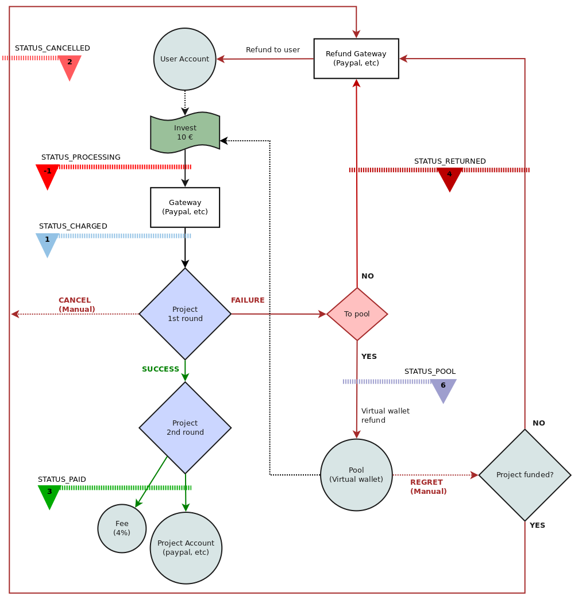

Payment processing
==================

The following graphic shows the life-cycle of a final user payment.

### Invest status:

The status of the Invest Model object (table `invest`, column `status`) relates to which part of the payments' cycle we are.

* -1 `STATUS_PROCESSING` payment gateway not reached yet or just a failed payment
*  0 `STATUS_PENDING`    Requires post-processing (for deprecated paypal preapprovals)
*  1 `STATUS_CHARGED`    Charged by the platform
*  2 `STATUS_CANCELLED`  Refunded to the user by some admin manual action, it won't be added to any total
*  3 `STATUS_PAID`       Paid to the project (successful project)
*  4 `STATUS_RETURNED`   Automatically refunded to the user due a failed project
*  5 `STATUS_RELOCATED`  Deprecated status
*  6 `STATUS_TO_POOL`       Refunded to user's pool
    
### Payment events

Events can be used to attach or modify functionality when some action happens.

In addition to the [Symfony's Built-in Kernel Events](http://symfony.com/doc/current/components/http_kernel/introduction.html#component-http-kernel-event-table), this are the events related to the payment process:

* `INVEST_INIT` The invest.init event is thrown each time a user starts a payment process
* `INVEST_INIT_REQUEST` The invest.init.request event is thrown each time a user sends a request to the payment gateway
* `INVEST_INIT_REDIRECT` The invest.init.redirect event is thrown each time a user its been redirected to the payment gateway
* `INVEST_NOTIFY` The invest.notify event is thrown each time the payment gateway reaches the notifyUrl to confirm the transaction
* `INVEST_COMPLETE` The invest.compelte event is thrown each time the payment gateway returns to a notifyUrl or returnUrl
* `INVEST_COMPLETE_REQUEST` The invest.complete.request event is thrown each time a user sends a request to the payment gateway to confirm the transaction
* `INVEST_FAILED` The invest.failed event is thrown each time a user fails to complete a payment process
* `INVEST_SUCCEEDED` The invest.success event is thrown each time a user completes a successful payment
* `INVEST_FINISHED` The invest.finished event is thrown each time a user completes a successful personal data entry
* `INVEST_CANCELLED` The invest.refund.cancel event is thrown each time a payments processes a refund
* `INVEST_CANCEL_FAILED = ` The invest.refund.cancel.failed event is thrown when manual refund it's done (normally a admin call)
* `INVEST_RETURNED` The invest.refund.return event is thrown each time a payments processes a refund
* `INVEST_RETURN_FAILED` The invest.refund.cancel event is thrown a refund process

Full list of Application Events can be found in `src/Goteo/Application/AppEvents.php`

Some other Console events may be taken into account as well (in addition to [Symfony's Built-in Console Events](http://symfony.com/doc/current/components/console/events.html)):

* `INVEST_CANCELLED` The console.refund.cancel event is thrown each time a payments processes a refund for any reason others than the project related is not archived/failed
* `INVEST_CANCEL_FAILED` The console.refund.cancel.failed event is thrown when manual refund it's done (normally a admin call)
* `INVEST_RETURNED` The console.refund.return event is thrown each time a payments processes a refund
* `INVEST_RETURN_FAILED` The console.refund.cancel event is thrown a refund process

Full list of Console Events can be found in `src/Goteo/Console/ConsoleEvents.php`

### Payment gateway

Since version 3.0, Goteo uses the [Omnipay](http://omnipay.thephpleague.com/) payment processing library. 
Any gateway supported by that library should be able to work with Goteo. However there's still a couple of things to be refactored to really achieved this goal. So, at the moment only the Paypal gateway is implemented (there are 2 others internal gateways added for development Dummy and Cash).

Still to be done:

* Payment reports in the admin with any gateway `src/Goteo/Controller/Admin/ReportsSubController.php`) and (`src/Goteo/Model/Invest.php`, function `getReportData()`)
